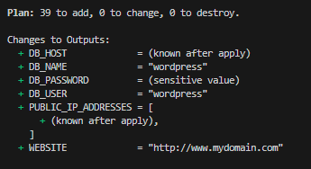

## Note to the reader

The steps described below are to satisfy the tasklist identified for [Project 0](../README.md) in the parent folder.

## Step-by-step Instructions (using terraform)
1. Download this repository to your local workstation
2. Install terraform
3. Install AWS CLI
4. Begin your lab, login via web browser to aws console. Create IAM user access key, place data in a post-it/notepad
5. Authenticate AWS CLI for the first-time, using `aws configure` to check the authentication details work.
6. Launch a BASH or PowerShell terminal. and set 3x variables:
    ```
    $env:AWS_ACCESS_KEY_ID="<KEY-GOES-HERE>"
    $env:AWS_SECRET_ACCESS_KEY="<SECRET-VALUE-GOES-HERE>"
    $env:AWS_REGION="us-east-1"
    ```
7. Initialise Terraform using `terraform init`
8. Plan for the buildout, using `terraform plan`. The following output should be visible:
    ```
    Plan: 19 to add, 0 to change, 0 to destroy.
    ```
9. Apply all changes using `terraform apply -auto-approve`. The following output should be visible:
    ```
    Apply complete! Resources: 19 added, 0 changed, 0 destroyed.
    ```


And the key information for administering the service:



