## Preface

Author: Simon Jackson (sjackson0109)

Date: 10/02/2024

## Real-world relevant scenario
This is a relevant real-world scenario, as plenty of companies need to make use of Wordpress.

## Objective
To set up and monitor a WordPress instance for your organisation inside AWS, using Cloud Formation.

## Refined milestones
- Launch both EC2 and RDS instances using AWS CloudFormation
- Configure RDS with Backup and Maintenance lifecycles
- (optional) Confirm RDS Instances is configured for Multi-AZ
- Setup EC2 Instances, with user_data one-time boot scripts, to configure NginX
- ... install the Wordpress Frontend and configure it's database connection
- Limit the flow of traffic using Security Groups
- Attach a domain using Route53
- Monitor each EC2 instance using Route53 Health Checks
- (optional) Trigger DNS Traffic-Flow Policies based on the status of Health Checks (or use ALB)
- (optional) Configure the Elastic Load Balancer to distribute client traffic to each ec2 instance, use session-persistant options  (or use Traffic-Flow Policies)
- Configure nginx error document handling, saving to an S3 bucket
- Set up a duplicate WordPress instance (to be used for development/testing), ensure this will only be available only for business hours (M-F 9 AM–6 PM)

## Decision Tree
-   **A default VPC with subnets already exists, will we use our own? YES**

    By delivering our own VPC with 4x Subnets - we meet the objective of an isolated environment, knowing exactly what resources are attached to our VPC.
    
    The VPC will have a CIDR of 10.101.0.0/16

    2x subnets in each region, and one subnet in each region public facing. 
    - pub-us-east-1a (10.101.0.0/24)
    - pub-us-east-1b (10.101.1.0/24)
    - priv-us-east-2a (10.101.2.0/24)
    - priv-us-east-2b (10.101.3.0/24)

-   **Do we need an Internet Gateway? YES**
    
    Routing traffic into/out of the public-facing front-end requires an internet gateway.

-   **Do we need Elastic IP Addresses on our EC2 Instances? YES**

    We need Elastic IP Addresses for remote administration (SSH) to each EC2 Instance, and to expose the web-frontend over HTTP/S (tcp/80 or tcp/443).

-   **Are we registering a DNS Zone? YES**

    To avoid the added complexity, or unnecessary cost, of an elastic load balancer; we can simply rely on Route 53 Health Checks, through a traffic-flow policy, to route clients to an active frontend. Thus this solution will be considered an `active/failover form of high-availability` only. 

-   **Are clients going to reach the front-end over the internet? YES**

    Simply targeting their web browser towards: http://www.mydomain.com.

-   **Are we going to use NAT Gateways, one per public facing subnet? NO**

    If we were to Proxy, or Load Balance the ingress WAN traffic, then perhaps a NAT Gateway might make sense. For now this is not necessary.

-   **Are we going to register an SSL Certificate, on each EC2 instance?  No**

    We would need to automate the certificate renewal process to achieve this. Whilst this is possible with Certbot scripting, there are layers of complexity here that remain outside of the objectives of this project. Namely:
    
    {

    - ACME v1 HTTP calls, require file-system manipulation - to ensure ingress http calls reach the same file-system, we will need to use an Elastic File System, mounted on both EC2 instances, as the data are for our wordpress installation.  
    
    -or-

    - ACME v2 requires the establishment of IAM users, with API keys, IAM policies granting delegate access to the DNS Zone. ACME v2 would be a preferred method.

    }
    
    -and-
    
    {

    - Output PEM/CER files would need to be accessible on both EC2 instances - another advocator for EFS. Yet the Private Key should be stored securely; but readable by Apache/Nginx.
    
    }

-   **Are we using an RDS Instance? YES**

    We will manually deploy an RDS Cluster, configured for Multi-AZ.
    
    This cluster will require the 2x Private subnets to be added into a Database Security Group.

    The cluster should have 2 instances running, one in each region/subnet.

    A single database-instance called "wordpress" should be registered 

-   **Are we blocking TCP/UDP ports where necessary? YES**

    Inspite the EC2 Instances will likely only be listening on certain TCP ports; it's always a good idea to control Ingress and Egress traffic. Rules will include:
 
    - Ingress SSH (TCP/22) from my home public IP allowed to reach the Public facing subnets (changes daily, so am not fussed in publishing it).
    
    - Ingress HTTP (TCP/80) and HTTPS (TCP/443) from any source, targeting the Public facing subnet.

    - Egress MySQL (TCP/3306) from the front-end subnets, to the back-end subnets. This rule needs duplicating on the frontend-security-group and the backend-security-group.

-   **Are we going to use user_data scripts to automate the installation of wordpress? YES**

    USER_DATA scripts are useful for first-time-boot, only.
    
    Thus, manually installing wordpress-frontend, and then extracting the history from the bash `history` command, would be an easy way to prepare a valid user_data script. The EC2 instance can then have the user_data updated; and finally we can convert this EC2 disk into a new AIM image.

    We can then consider creating scale out the EC2 instance, with deployed copies of this AIM template disk.

## Intended Architecture

```mermaid
graph TD
    direction TB

    classDef default color:#000;
    classDef dns fill:#c2e0c6,stroke:#16a085,line-height:18px;
    classDef public fill:#9b59b6,stroke:#8e44ad,color:transparent;
    classDef private fill:#34495e,stroke:#2c3e50,color:transparent;
    classDef db-subnet-group color:#000,fill:transparent,stroke:#F58536,stroke-width:2px,stroke-dasharray:6;
    classDef hidden color:#000,fill:transparent,stroke:transparent,padding:0px,margin:0px;
    classDef acm fill:#FF9900,stroke:#333;
    classDef afs fill:#F9C202,stroke:#333;
    classDef ai fill:#54B435,stroke:#333;
    classDef alb fill:#F58536,stroke:#333;
    classDef apigateway fill:#00B3F4,stroke:#333;
    classDef appmesh fill:#005EA5,stroke:#333;
    classDef apprunner fill:#FF471A,stroke:#333;
    classDef athena fill:#8F3E9E,stroke:#333;
    classDef autoscaling fill:#E43A15,stroke:#333;
    classDef beam fill:#F7931A,stroke:#333;
    classDef budgets fill:#FFC000,stroke:#333;
    classDef cloud9 fill:#434343,stroke:#333;
    classDef cloudformation fill:#8C959E,stroke:#333;
    classDef cloudfront fill:#F5F5F5,stroke:#333;
    classDef cloudsearch fill:#54B435,stroke:#333;
    classDef cloudtrail fill:#999999,stroke:#333;
    classDef cloudwatch fill:#F58536,stroke:#333;
    classDef codebuild fill:#4FC08D,stroke:#333;
    classDef codecommit fill:#F05032,stroke:#333;
    classDef codedeploy fill:#F7931A,stroke:#333;
    classDef codepipeline fill:#3333FF,stroke:#333;
    classDef codestar fill:#F7931A,stroke:#333;
    classDef cognito fill:#FDB827,stroke:#333;
    classDef config fill:#F9C202,stroke:#333;
    classDef curl fill:#000000,stroke:#333;
    classDef datapipeline fill:#8C959E,stroke:#333;
    classDef datasync fill:#3D9970,stroke:#333;
    classDef dax fill:#F58536,stroke:#333;
    classDef database fill:#3333FF,stroke:#333;
    classDef dms fill:#8C959E,stroke:#333;
    classDef docdb fill:#405884,stroke:#333;
    classDef ds fill:#00B3F4,stroke:#333;
    classDef dynamodb fill:#405884,stroke:#333;
    classDef ebs fill:#F9C202,stroke:#333;
    classDef ec2 fill:transparent,stroke:#333,margin:0px,border:0px,stroke-width:0px,padding:0px;
    classDef ecs fill:#FF9900,stroke:#333;
    classDef efs fill:transparent,stroke:#fff;
    classDef eip fill:#F58536,stroke:#333,line-height:18px;
    classDef elasticache fill:#3D9970,stroke:#333;
    classDef elasticbeanstalk fill:#F7931A,stroke:#333;
    classDef elasticsearch fill:#005EA5,stroke:#333;
    classDef emr fill:#FDB827,stroke:#333;
    classDef eks fill:#005EA5,stroke:#333;
    classDef es fill:#005EA5,stroke:#333;
    classDef eventbridge fill:#00B3F4,stroke:#333;
    classDef firehose fill:#F58536,stroke:#333;
    classDef forecast fill:#00B3F4,stroke:#333;
    classDef fsx fill:#F58536,stroke:#333;
    classDef glacier fill:#C0C0C0,stroke:#333;
    classDef globalaccelerator fill:#F9C202,stroke:#333;
    classDef guardduty fill:#747F8D,stroke:#333;
    classDef ig fill:#FF9900,stroke:#333;
    classDef inspector fill:#FDB827,stroke:#333;
    classDef iot fill:#405884,stroke:#333;
    classDef iotanalytics fill:#F9C202,stroke:#333;
    classDef iotevents fill:#FDB827,stroke:#333;
    classDef iotthingsgraph fill:#F7931A,stroke:#333;
    classDef kafka fill:#005EA5,stroke:#333;
    classDef kinesis fill:#F58536,stroke:#333;
    classDef kinesisanalytics fill:#F9C202,stroke:#333;
    classDef kinesisvideo fill:#FDB827,stroke:#333;
    classDef lakeformation fill:#00B3F4,stroke:#333;
    classDef lambda fill:#F7931A,stroke:#333;
    classDef licensemanager fill:#8C959E,stroke:#333;
    classDef macie fill:#FF471A,stroke:#333;
    classDef marketplace fill:#405884,stroke:#333;
    classDef marketplacemetering service:#FDB827,stroke:#333;
    classDef mediaconnect fill:#F58536,stroke:#333;
    classDef mediaconvert fill:#00B3F4,stroke:#333;
    classDef medialive fill:#F9C202,stroke:#333;
    classDef mediapackage fill:#005EA5,stroke:#333;
    classDef mediastore fill:#3D9970,stroke:#333;
    classDef mediastore-data fill:#E43A15,stroke:#333;
    classDef mediatailor fill:#F58536,stroke:#333;
    classDef memorydb fill:#005EA5,stroke:#333;
    classDef migrationhub fill:#8C959E,stroke:#333;
    classDef mobile fill:#FDB827,stroke:#333;
    classDef mq fill:#F58536,stroke:#333;
    classDef neptune fill:#3333FF,stroke:#333;
    classDef networkmanager fill:#F9C202,stroke:#333;
    classDef opsworks fill:#F7931A,stroke:#333;
    classDef opsworkscm fill:#00B3F4,stroke:#333;
    classDef organizations fill:#8C959E,stroke:#333;
    classDef qldb fill:#F58536,stroke:#333;
    classDef quicksight fill:#005EA5,stroke:#333;
    classDef rds fill:#3333FF,stroke:#333,margin:0px,border:0px,stroke-width:0px,padding:0px;
    classDef redshift fill:#E43A15,stroke:#333;
    classDef rekognition fill:#FDB827,stroke:#333;
    classDef resourcegroups fill:#F9C202,stroke:#333;
    classDef rds fill:transparent,stroke:#fff;
    classDef route53 fill:#F58536,stroke:#333;
    classDef route53domains fill:#00B3F4,stroke:#333;
    classDef route53resolver fill:#005EA5,stroke:#333;
    classDef s3 fill:#405884,stroke:#333;
    classDef s3control fill:#F9C202,stroke:#333;
    classDef s3outposts fill:#F58536,stroke:#333;
    classDef sagemaker fill:#F58536,stroke:#333;
    classDef sagemaker fill:#FDB827,stroke:#333;
    classDef secretsmanager fill:#F58536,stroke:#333;
    classDef serverlessapprepo fill:#00B3F4,stroke:#333;
    classDef servicecatalog fill:#8C959E,stroke:#333;
    classDef sg fill:transparent,stroke:#FF5733,color:#000;
    classDef shield fill:#E43A15,stroke:#333;
    classDef signer fill:#F9C202,stroke:#333;
    classDef sms fill:#005EA5,stroke:#333;
    classDef snowball fill:#FDB827,stroke:#333;
    classDef sso fill:#F58536,stroke:#333;
    classDef storagegateway fill:#54B435,stroke:#333;
    classDef sts fill:#999999,stroke:#333;
    classDef subnet color:#000,fill:#fff,stroke:#F58536,stroke-width:2px,stroke-dasharray:6;
    classDef support fill:#F9C202,stroke:#333;
    classDef swf fill:#F7931A,stroke:#333;
    classDef textract fill:#00B3F4,stroke:#333;
    classDef transcribe fill:#FDB827,stroke:#333;
    classDef translate fill:#3D9970,stroke:#333;
    classDef trebuchet fill:#F58536,stroke:#333;
    classDef vpc color:#000,fill:#fff,stroke:#F58536,stroke-width:2px,stroke-dasharray:6;
    classDef workdocs fill:#8C959E,stroke:#333;
    classDef worklink fill:#E43A15,stroke:#333;
    classDef workspaces fill:#F9C202,stroke:#333;
    classDef xray fill:#F7931A,stroke:#333;


    subgraph vpc["wordpress-vpc"]
        direction TB

        ig{"Internet<br>Gateway"}
        dns["www.mydomain.com"]
        dns --- eip1
        dns --- eip2
        eip1[Elastic IPa] ---> ec21
        eip2[Elastic IPb] ---> ec22

        subgraph sg-public["Public <br><br><br><br><br><br> Wordpress Frontend"]
            direction LR
            subgraph public-us-east-1a["us-east-1a<br><br><br><br>10.101.0.0/24"]
                ec21["<img class='Icon' src='https://icon.icepanel.io/AWS/svg/Compute/EC2.svg' /> EC2a"]
            end
            subgraph public-us-east-1b["us-east-1b<br><br><br><br>10.101.1.0/24"]
                ec22["<img class='Icon' src='https://icon.icepanel.io/AWS/svg/Compute/EC2.svg' /> EC2b"]
            end
        end

        subgraph efs-storage["/mnt/efs/data"]
            efs["<img class='Icon' src='https://icon.icepanel.io/AWS/svg/Storage/EFS.svg' /> EFS"]
        end
        subgraph sg-private["Private <br><br><br><br><br><br><br> MySQL Backend"]
            subgraph db-subnet-group["db-subnet-group"]
                direction TB
                subgraph private-us-east-1a["us-east-1a<br><br><br><br>10.101.2.0/24"]
                    rds1["<img class='Icon' src='https://icon.icepanel.io/AWS/svg/Database/RDS.svg' /> RDSa"]
                end
                subgraph private-us-east-1b["us-east-1b<br><br><br><br>10.101.3.0/24"]
                    rds2["<img class='Icon' src='https://icon.icepanel.io/AWS/svg/Database/RDS.svg' /> RDSb"]
                end
            end
        end

    end

    ig ----- sg-public
    ec21 ---- rds1
    ec21 -.- rds2
    ec22 ---- rds1
    ec22 -.- rds2


    ec21 --- efs
    ec22 --- efs
    class ig ig;
    class dns dns;
    class eip1,eip2 eip;
    class ec21,ec22 ec2;
    class efs efs;
    class efs-storage hidden;
    class rds1,rds2 rds;
    class public-us-east-1a,public-us-east-1b subnet;
    class private-us-east-1a,private-us-east-1b subnet;
    class db-subnet-group db-subnet-group;
    class sg-private,sg-public sg;
    class vpc vpc;
```

## Tasklist
1. Create the VPC with Subnets
2. Create Key Pairs
3. Create the Security Groups, ensure these are attached to the respective subnets
4. Create a Internet Gateway (if not included with the VPC)
5. Create an RDS Cluster, with multi-az, and two subnets in the db-subnet-group, include 1x database called `wordpress`. Configure Cluster scaling, so we always have a replica
6. Create an Elastic File System
7. Create 1x EC2 instance, with Ubuntu on, dev/test, containers, select vpc, select/create SG, select EFS (/mnt/sfs/data)   
8. SSH in and configure the VM for Apache/Nginx, PHP
9. Connect to RDS, and create a `wordpress` database, with a admin credential.
   Create another `wordpress` user and grant access to the `wordpress` database and schema.

10. Connect to the EC2 Instance, and prepare the OS for Apache, with PHP
11. Download the `latest` instance of wordpress, extract and copy to /var/www/html folder.
12. Configure a `wp-config.php` file with the necessary database-connection-string
13. Start the web-service, and register the web-service to run on machine start-up
14. Export the SSH history using `history` command

## Step-by-step Instructions (using terraform)
The terraform instructions can be found [here](<./Method 0 - terraform/README.md>)

## Step-by-step Instructions (aws console)
The terraform instructions can be found [here](<./Method 1 - aws console/README.md>)

