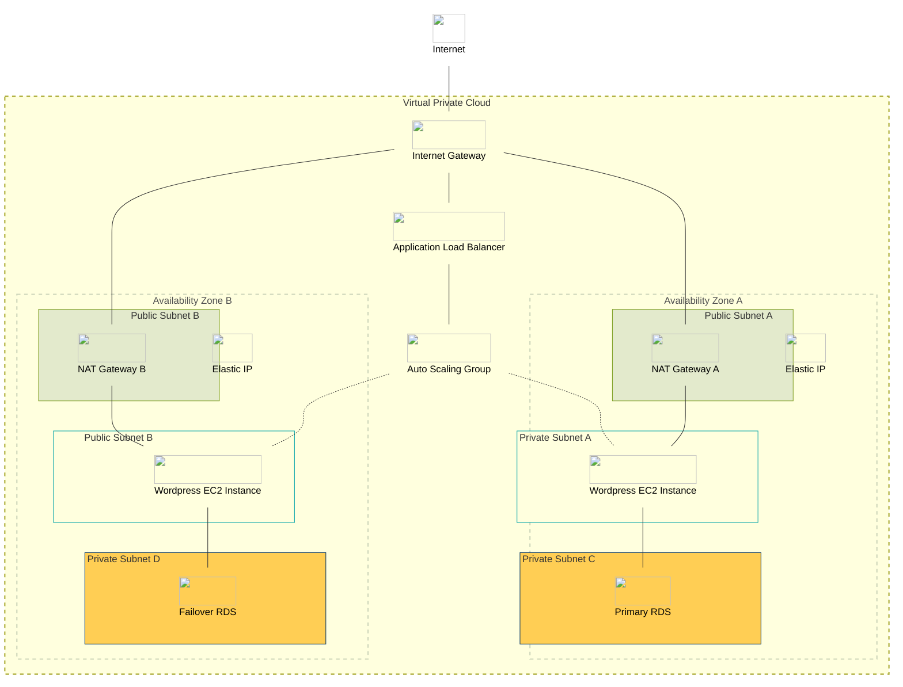

```mermaid
graph TD

Internet["<img src="https://sashee.github.io/aws-svg-icons/Resource-Icons_07302021/Res_General-Icons/Res_48_Light/Res_Internet_48_Light.svg" style="height:48px;" /> Internet"] --- igw
igw ---- natGwA
igw ---- natGwB
    subgraph vpc["Virtual Private Cloud"]

        igw["<img src="https://sashee.github.io/aws-svg-icons/Architecture-Service-Icons_07302021/Arch_Storage/48/Arch_AWS-Storage-Gateway_48.svg" style="height:48px;" />Internet Gateway"]

        subgraph azA["Availability Zone A"]
            subgraph psA["Public Subnet A"]
                direction LR
                natGwA["<img src="https://sashee.github.io/aws-svg-icons/Resource-Icons_07302021/Res_Networking-and-Content-Delivery/Res_48_Dark/Res_Amazon-VPC_NAT-Gateway_48_Dark.svg" style="height:48px;" />NAT Gateway A"]
                eip1["<img src="https://sashee.github.io/aws-svg-icons/Resource-Icons_07302021/Res_Compute/Res_48_Light/Res_Amazon-EC2_Elastic-IP-Address_48_Light.svg" style="height:48px;" />Elastic IP"]
            end
            subgraph psC["Private Subnet A"]
                direction LR
                ec2A["<img src="https://sashee.github.io/aws-svg-icons/Architecture-Service-Icons_07302021/Arch_Compute/64/Arch_Amazon-EC2_64.svg" style="height:48px;" />Wordpress EC2 Instance"]
            end
            subgraph psE["Private Subnet C"]
                direction LR
                rds1["<img src="https://sashee.github.io/aws-svg-icons/Resource-Icons_07302021/Res_Database/Res_48_Light/Res_Amazon-Aurora_Amazon-RDS-Instance_48_Light.svg" style="height:48px;" />Primary RDS"]
            end
        end
        alb["<img src="https://sashee.github.io/aws-svg-icons/Architecture-Service-Icons_07302021/Arch_Networking-Content-Delivery/64/Arch_Elastic-Load-Balancing_64.svg" style="height:48px;" />Application Load Balancer"]
        asg["<img src="https://sashee.github.io/aws-svg-icons/Resource-Icons_07302021/Res_Compute/Res_48_Dark/Res_Amazon-EC2_Auto-Scaling_48_Dark.svg" style="height:48px;" />Auto Scaling Group"]
        subgraph azB["Availability Zone B"]
            subgraph psB["Public Subnet B"]
                direction LR
                eip2["<img src="https://sashee.github.io/aws-svg-icons/Resource-Icons_07302021/Res_Compute/Res_48_Light/Res_Amazon-EC2_Elastic-IP-Address_48_Light.svg" style="height:48px;" />Elastic IP"]
                natGwB["<img src="https://sashee.github.io/aws-svg-icons/Resource-Icons_07302021/Res_Networking-and-Content-Delivery/Res_48_Dark/Res_Amazon-VPC_NAT-Gateway_48_Dark.svg" style="height:48px;" />NAT Gateway B"]
            end
            subgraph psD["Public Subnet B"]
                direction LR
                ec2B["<img src="https://sashee.github.io/aws-svg-icons/Architecture-Service-Icons_07302021/Arch_Compute/64/Arch_Amazon-EC2_64.svg" style="height:48px;" />Wordpress EC2 Instance"]
            end
            subgraph psF["Private Subnet D"]
                direction LR
                rds2["<img src="https://sashee.github.io/aws-svg-icons/Resource-Icons_07302021/Res_Database/Res_48_Light/Res_Amazon-Aurora_Amazon-RDS-Instance_48_Light.svg" style="height:48px;" />Failover RDS"]
            end
        end
    end

natGwA --- ec2A --- rds1
igw --- alb --- asg
asg -.- ec2A
asg -.- ec2B
natGwB --- ec2B --- rds2

classDef default color:#000,fill:transparent,stroke:transparent;
classDef vpc fill:#1122cwstroke:#8c4ffe,stroke-width:2px,stroke-dasharray:6;
classDef az color:#505050,stroke:#cdd5ba,stroke-width:2px,stroke-dasharray:6;
classDef awsPublicSubnet fill:#e3eacc,stroke:#7b9c1d,width:300px;
classDef awsEC2Subnet float:left,fill:#86a97,stroke:#03a4a9,width:400px;
classDef awsRDSSubnet float:left,fill:#FFCE54,stroke:#003366,width:400px;

class vpc vpc;
class azA,azB az;
class psA,psB awsPublicSubnet;
class psC,psD awsEC2Subnet;
class psE,psF awsRDSSubnet;

```