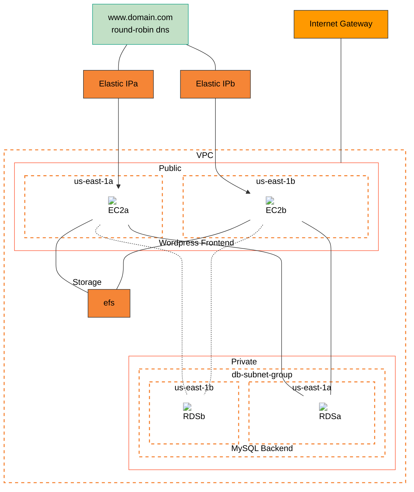

# Fully Redundant VPC, 2x EC2 Instances with dedicated EIP, Multi-AZ RDS, running MYSQL on a private subnet, RT via an IG 

```mermaid
graph TD
    direction TB

    classDef default color:#000;
    classDef dns fill:#c2e0c6,stroke:#16a085;
    classDef public fill:#9b59b6,stroke:#8e44ad,color:transparent;
    classDef private fill:#34495e,stroke:#2c3e50,color:transparent;
    classDef db-subnet-group color:#000,fill:transparent,stroke:#F58536,stroke-width:2px,stroke-dasharray:6;
    classDef hidden color:#000,fill:transparent,stroke:transparent,padding:0px,margin:0px;

    classDef acm fill:#FF9900,stroke:#333;
    classDef afs fill:#F9C202,stroke:#333;
    classDef ai fill:#54B435,stroke:#333;
    classDef alb fill:#F58536,stroke:#333;
    classDef apigateway fill:#00B3F4,stroke:#333;
    classDef appmesh fill:#005EA5,stroke:#333;
    classDef apprunner fill:#FF471A,stroke:#333;
    classDef athena fill:#8F3E9E,stroke:#333;
    classDef autoscaling fill:#E43A15,stroke:#333;
    classDef beam fill:#F7931A,stroke:#333;
    classDef budgets fill:#FFC000,stroke:#333;
    classDef cloud9 fill:#434343,stroke:#333;
    classDef cloudformation fill:#8C959E,stroke:#333;
    classDef cloudfront fill:#F5F5F5,stroke:#333;
    classDef cloudsearch fill:#54B435,stroke:#333;
    classDef cloudtrail fill:#999999,stroke:#333;
    classDef cloudwatch fill:#F58536,stroke:#333;
    classDef codebuild fill:#4FC08D,stroke:#333;
    classDef codecommit fill:#F05032,stroke:#333;
    classDef codedeploy fill:#F7931A,stroke:#333;
    classDef codepipeline fill:#3333FF,stroke:#333;
    classDef codestar fill:#F7931A,stroke:#333;
    classDef cognito fill:#FDB827,stroke:#333;
    classDef config fill:#F9C202,stroke:#333;
    classDef curl fill:#000000,stroke:#333;
    classDef datapipeline fill:#8C959E,stroke:#333;
    classDef datasync fill:#3D9970,stroke:#333;
    classDef dax fill:#F58536,stroke:#333;
    classDef database fill:#3333FF,stroke:#333;
    classDef dms fill:#8C959E,stroke:#333;
    classDef docdb fill:#405884,stroke:#333;
    classDef ds fill:#00B3F4,stroke:#333;
    classDef dynamodb fill:#405884,stroke:#333;
    classDef ebs fill:#F9C202,stroke:#333;
    classDef ec2 fill:transparent,stroke:#333,margin:0px,border:0px,stroke-width:0px,padding:0px;
    classDef ecs fill:#FF9900,stroke:#333;
    classDef efs fill:#F58536,stroke:#333;
    classDef eip fill:#F58536,stroke:#333;
    classDef elasticache fill:#3D9970,stroke:#333;
    classDef elasticbeanstalk fill:#F7931A,stroke:#333;
    classDef elasticsearch fill:#005EA5,stroke:#333;
    classDef emr fill:#FDB827,stroke:#333;
    classDef eks fill:#005EA5,stroke:#333;
    classDef es fill:#005EA5,stroke:#333;
    classDef eventbridge fill:#00B3F4,stroke:#333;
    classDef firehose fill:#F58536,stroke:#333;
    classDef forecast fill:#00B3F4,stroke:#333;
    classDef fsx fill:#F58536,stroke:#333;
    classDef glacier fill:#C0C0C0,stroke:#333;
    classDef globalaccelerator fill:#F9C202,stroke:#333;
    classDef guardduty fill:#747F8D,stroke:#333;
    classDef ig fill:#FF9900,stroke:#333;
    classDef inspector fill:#FDB827,stroke:#333;
    classDef iot fill:#405884,stroke:#333;
    classDef iotanalytics fill:#F9C202,stroke:#333;
    classDef iotevents fill:#FDB827,stroke:#333;
    classDef iotthingsgraph fill:#F7931A,stroke:#333;
    classDef kafka fill:#005EA5,stroke:#333;
    classDef kinesis fill:#F58536,stroke:#333;
    classDef kinesisanalytics fill:#F9C202,stroke:#333;
    classDef kinesisvideo fill:#FDB827,stroke:#333;
    classDef lakeformation fill:#00B3F4,stroke:#333;
    classDef lambda fill:#F7931A,stroke:#333;
    classDef licensemanager fill:#8C959E,stroke:#333;
    classDef macie fill:#FF471A,stroke:#333;
    classDef marketplace fill:#405884,stroke:#333;
    classDef marketplacemetering service:#FDB827,stroke:#333;
    classDef mediaconnect fill:#F58536,stroke:#333;
    classDef mediaconvert fill:#00B3F4,stroke:#333;
    classDef medialive fill:#F9C202,stroke:#333;
    classDef mediapackage fill:#005EA5,stroke:#333;
    classDef mediastore fill:#3D9970,stroke:#333;
    classDef mediastore-data fill:#E43A15,stroke:#333;
    classDef mediatailor fill:#F58536,stroke:#333;
    classDef memorydb fill:#005EA5,stroke:#333;
    classDef migrationhub fill:#8C959E,stroke:#333;
    classDef mobile fill:#FDB827,stroke:#333;
    classDef mq fill:#F58536,stroke:#333;
    classDef neptune fill:#3333FF,stroke:#333;
    classDef networkmanager fill:#F9C202,stroke:#333;
    classDef opsworks fill:#F7931A,stroke:#333;
    classDef opsworkscm fill:#00B3F4,stroke:#333;
    classDef organizations fill:#8C959E,stroke:#333;
    classDef qldb fill:#F58536,stroke:#333;
    classDef quicksight fill:#005EA5,stroke:#333;
    classDef rds fill:#3333FF,stroke:#333,margin:0px,border:0px,stroke-width:0px,padding:0px;
    classDef redshift fill:#E43A15,stroke:#333;
    classDef rekognition fill:#FDB827,stroke:#333;
    classDef resourcegroups fill:#F9C202,stroke:#333;
    classDef rds fill:transparent,stroke:#fff;
    classDef route53 fill:#F58536,stroke:#333;
    classDef route53domains fill:#00B3F4,stroke:#333;
    classDef route53resolver fill:#005EA5,stroke:#333;
    classDef s3 fill:#405884,stroke:#333;
    classDef s3control fill:#F9C202,stroke:#333;
    classDef s3outposts fill:#F58536,stroke:#333;
    classDef sagemaker fill:#F58536,stroke:#333;
    classDef sagemaker fill:#FDB827,stroke:#333;
    classDef secretsmanager fill:#F58536,stroke:#333;
    classDef serverlessapprepo fill:#00B3F4,stroke:#333;
    classDef servicecatalog fill:#8C959E,stroke:#333;
    classDef sg fill:transparent,stroke:#FF5733,color:#000;
    classDef shield fill:#E43A15,stroke:#333;
    classDef signer fill:#F9C202,stroke:#333;
    classDef sms fill:#005EA5,stroke:#333;
    classDef snowball fill:#FDB827,stroke:#333;
    classDef sso fill:#F58536,stroke:#333;
    classDef storagegateway fill:#54B435,stroke:#333;
    classDef sts fill:#999999,stroke:#333;
    classDef subnet color:#000,fill:#fff,stroke:#F58536,stroke-width:2px,stroke-dasharray:6;
    classDef support fill:#F9C202,stroke:#333;
    classDef swf fill:#F7931A,stroke:#333;
    classDef textract fill:#00B3F4,stroke:#333;
    classDef transcribe fill:#FDB827,stroke:#333;
    classDef translate fill:#3D9970,stroke:#333;
    classDef trebuchet fill:#F58536,stroke:#333;
    classDef vpc color:#000,fill:#fff,stroke:#F58536,stroke-width:2px,stroke-dasharray:6;
    classDef workdocs fill:#8C959E,stroke:#333;
    classDef worklink fill:#E43A15,stroke:#333;
    classDef workspaces fill:#F9C202,stroke:#333;
    classDef xray fill:#F7931A,stroke:#333;

    ig["Internet Gateway"]
    dns["www.domain.com<br> round-robin dns"]
    dns --- eip1
    dns --- eip2
    eip1[Elastic IPa] ---> ec21
    eip2[Elastic IPb] ---> ec22

    subgraph vpc["VPC"]
        direction LR

        subgraph sg-public["Public <br><br><br><br><br><br> Wordpress Frontend"]
            direction LR
            subgraph public-us-east-1a["us-east-1a"]
                ec21["<img class='Icon' src='https://icon.icepanel.io/AWS/svg/Compute/EC2.svg' /> EC2a"]
            end
            subgraph public-us-east-1b["us-east-1b"]
                ec22["<img class='Icon' src='https://icon.icepanel.io/AWS/svg/Compute/EC2.svg' /> EC2b"]
            end
        end

        subgraph efs-storage["Storage"]
            efs
        end
        subgraph sg-private["Private <br><br><br><br><br><br><br> MySQL Backend"]
            subgraph db-subnet-group["db-subnet-group"]
                direction TB
                subgraph private-us-east-1a["us-east-1a"]
                    rds1["<img class='Icon' src='https://icon.icepanel.io/AWS/svg/Database/RDS.svg' /> RDSa"]
                end
                subgraph private-us-east-1b["us-east-1b"]
                    rds2["<img class='Icon' src='https://icon.icepanel.io/AWS/svg/Database/RDS.svg' /> RDSb"]
                end
            end
        end

    end

    ig ----- sg-public
    ec21 ---- rds1
    ec21 -.- rds2
    ec22 ---- rds1
    ec22 -.- rds2


    ec21 --- efs
    ec22 --- efs
    class ig ig;
    class dns dns;
    class eip1,eip2 eip;
    class ec21,ec22 ec2;
    class efs efs;
    class efs-storage hidden;
    class rds1,rds2 rds;
    class public-us-east-1a,public-us-east-1b subnet;
    class private-us-east-1a,private-us-east-1b subnet;
    class db-subnet-group db-subnet-group;
    class sg-private,sg-public sg;
    class vpc vpc;
```