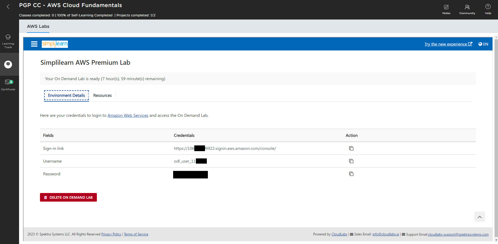

# Course: aws-solutions-architect
This repository stores course write-ups for building the AWS labs assignments, on the AWS Cloud Fundamentals course.

# Classroom
Between 10/01/2024 and 09/02/2024 this course was taught via remote classrooms (Zoom) over 4-hour intervals, the course lasted a total of 44 hours, typically over a weekend.
Each Lesson was presented by our SimpliLearn trainer. On the course we covered the agenda of:
| Lesson | Title |
|---|---|
| 1 | AWS Course Introduction |
| 2 | AWS Core Concepts |
| 3 | Compute and Related Features |
| 4 | Storage Services |
| 5 | Networking from VPCs to Load Balancing |
| 6 | Databases |
| 7 | Security and IAM |
| 8 | Serverless and Application Services |
| 9 | Monitoring and Automation |
| 10 | Container Services |
| 11 | Kinesis, Lambda, Firehose and others |

At the end of each lesson, we all had lab-activities to perform, sometimes 3-4 per-lesson, each to be completed within our own time. 

Towards the end, we were given several project items to consider, although only three was required to be submitted in order to pass the AWS-Solutions-Architect course on the Simplilearn LMS portal. 

## Access to AWS Labs
During the SimpliLearn Course we were given the opportunity to `create an AWS practice lab`, powered by [CloudLabs](https://cloudlabs.ai/). Starting one of these labs provides an `8-hour window` within which we can build/deploy/test almost anything, as long as we stick within the default region. We later found out this is also within the course-providers quota limits and approved regions.

We can simply start the practice lab, and then we will be presented with a login URL, iam_username and iam_password: EG:


You can reach the AWS console here: https://console.aws.com

## Generating your Access Key
Login to the AWS Management Console (GUI)
Navigate to the AMI section
Select your current user
Select `create access key`, select command line, click accept to the agreement, and click save
Click the reveal icon to view the secret value. Save these credentials for later use

Note: I had to do this a couple of times as the lab is only available for 8-hours.

## Prepare AWS CLI
`aws cli` is a downloadable application that is required to be installed as follows:
```
msiexec /i https://awscli.amazonaws.com/AWSCLIV2.msi
```

This installation registers the PATH parameter in windows, so re-launch your command line. and then configure the product using:
```
aws configure
```

Enter the following parameters:
```
$env:AWS_ACCESS_KEY_ID="{REDACTED}"
$env:AWS_SECRET_ACCESS_KEY="{REDACTED}"
$env:AWS_REGION="us-east-1"
```

## Preparing Terraform
`Terraform` can be downloaded from [here](https://developer.hashicorp.com/terraform/downloads), select the operating system and follow the relevant installation instructions.  I'm using Windows, so simply download the ZIP, and extracted it to `C:\Program Files\Hashicorp\Terraform`.
I also updated the PATH variable in windows to reflect the installation path of terraform.

Terraform typically has a state file that we should save on a shared-aread, to be accessible by multiple people/services. For this course, this is not necessary, a local state-file, with no additional configuration, is all that is required.

## Projects
Tackling each of the assignments (mini-projects with real-world applicability) as their own distinct set of objectives/challanges; the folder structure in this repository represents each assignment. There is also a PDF extract off the course-downloadable-content, which gives all the details needed to start designing/building on AWS.
|Projects | Name | Brief | Writeup |
|---|---|---|---|
| 0 | Set Up and Monitor a WordPress EC2 Instance for Your Organization |[Brief]( Project%200%20-%20Setup%20and%20Monitor%20Wordpress%20on%20AWS.pdf)|[Readme](./Project%200/README.md) |
| 1 | Infrastructure Deployment for Real-time Data Management Requirements on the AWS Cloud |[Brief]( Project%201%20-%20Deploy%20Real-Time%20Data%20Management%20on%20AWS.pdf)|[Readme](./Project%201/README.md) |
| 2 | Deploy a Multi-Timer Web App Using SQS |  |  |
| 3 | Deployment of Multicloud App |  |  |
| 4 | Azure and AWS Connection Architecture through VPC |  |  |